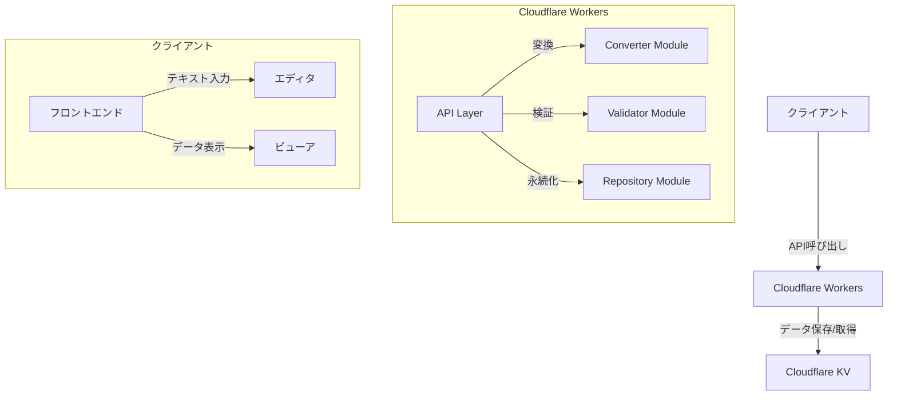
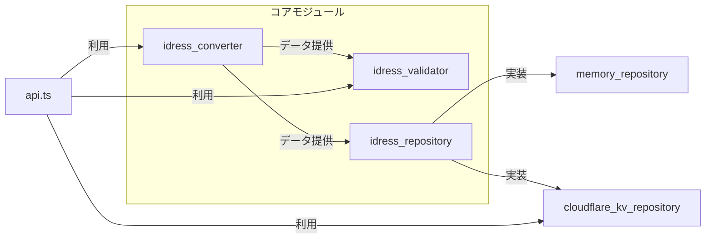
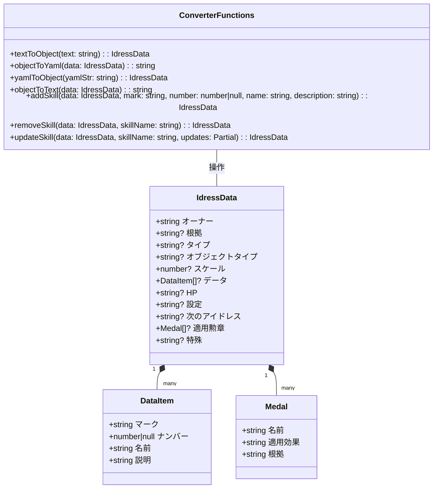
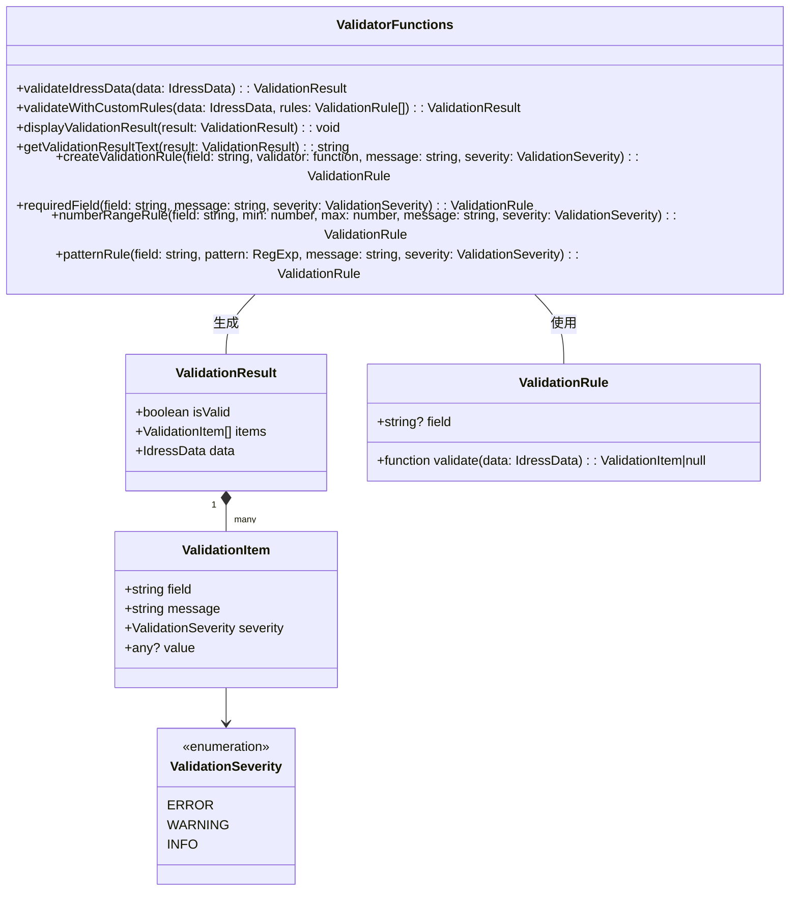
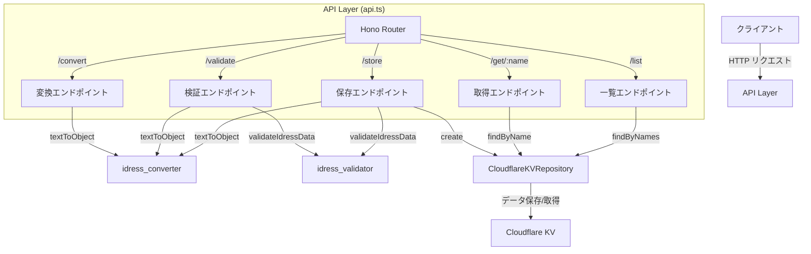
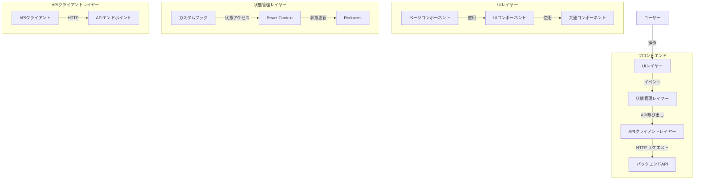
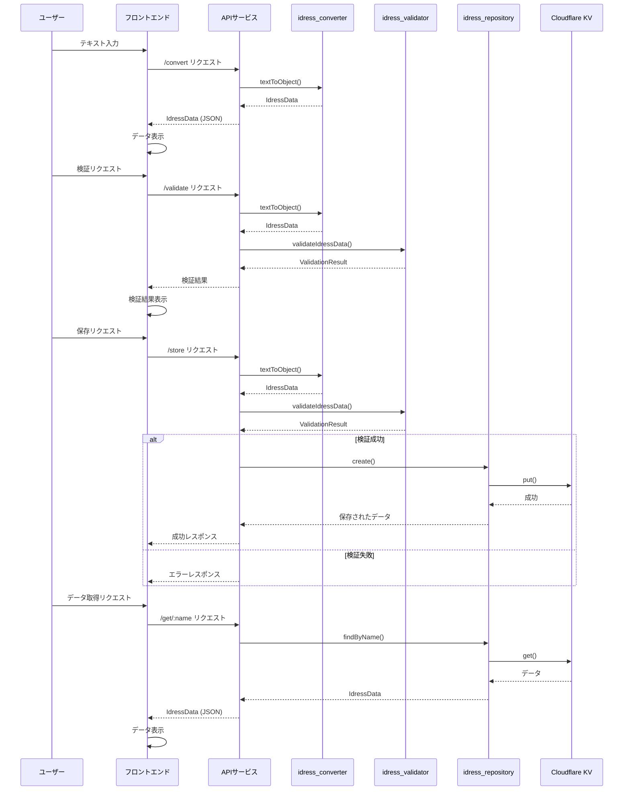
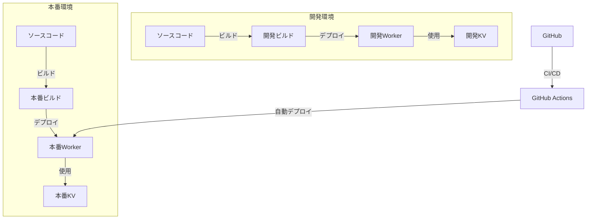

# アイドレスモジュール アーキテクチャ構成図

## 概要

アイドレスモジュールは、テキスト形式のアイドレスデータをYAML形式に変換し、TypeScriptオブジェクトとして操作・検証するライブラリと、Cloudflare Workersを使用したAPIサービスを提供するプロジェクトです。

このドキュメントでは、プロジェクト全体のアーキテクチャ構成を説明します。

## システム全体構成



## コアモジュール構成

アイドレスモジュールは以下の3つの主要モジュールで構成されています：



### 1. idress_converter モジュール

テキスト形式とYAML形式の相互変換、およびデータ操作機能を提供します。



### 2. idress_validator モジュール

アイドレスデータの検証と自動修正機能を提供します。



### 3. idress_repository モジュール

アイドレスデータの永続化と取得機能を提供します。

```mermaid
classDiagram
    class IdressRepository {
        <<interface>>
        +create(data: IdressData): Promise<IdressData>
        +findByName(name: string): Promise<IdressData|null>
        +findByNames(names: string[]): Promise<IdressData[]>
        +find(filter?: IdressFilter): Promise<IdressData[]>
        +update(name: string, data: Partial<IdressData>): Promise<IdressData|null>
        +delete(name: string): Promise<boolean>
    }
    
    class IdressFilter {
        +string? オーナー
        +string? タイプ
        +string? オブジェクトタイプ
        +string? 名前
        +string[]? 名前リスト
        +string[]? マーク
        +object? スケール
    }
    
    class IdressRepositoryFactory {
        <<interface>>
        +createRepository(options?: any): IdressRepository
    }
    
    class MemoryRepository {
        -Map<string, IdressData> dataStore
        -extractName(data: IdressData): string
        -generateKey(name: string): string
        -matchesFilter(data: IdressData, filter: IdressFilter): boolean
        +create(data: IdressData): Promise<IdressData>
        +findByName(name: string): Promise<IdressData|null>
        +findByNames(names: string[]): Promise<IdressData[]>
        +find(filter?: IdressFilter): Promise<IdressData[]>
        +update(name: string, data: Partial<IdressData>): Promise<IdressData|null>
        +delete(name: string): Promise<boolean>
        +clear(): Promise<void>
        +count(): Promise<number>
    }
    
    class MemoryRepositoryFactory {
        +createRepository(): IdressRepository
    }
    
    class CloudflareKVRepository {
        -KVNamespace namespace
        -string cacheKey
        -string[]|null indexCache
        -extractName(data: IdressData): string
        -generateKey(name: string): string
        -getIndex(): Promise<string[]>
        -updateIndex(keys: string[]): Promise<void>
        -addToIndex(key: string): Promise<void>
        -removeFromIndex(key: string): Promise<void>
        -matchesFilter(data: IdressData, filter: IdressFilter): boolean
        +create(data: IdressData): Promise<IdressData>
        +findByName(name: string): Promise<IdressData|null>
        +findByNames(names: string[]): Promise<IdressData[]>
        +find(filter?: IdressFilter): Promise<IdressData[]>
        +update(name: string, data: Partial<IdressData>): Promise<IdressData|null>
        +delete(name: string): Promise<boolean>
        +clear(): Promise<void>
        +count(): Promise<number>
    }
    
    class CloudflareKVRepositoryFactory {
        +createRepository(options: {namespace: KVNamespace}): IdressRepository
    }
    
    IdressRepository <|.. MemoryRepository : 実装
    IdressRepository <|.. CloudflareKVRepository : 実装
    IdressRepositoryFactory <|.. MemoryRepositoryFactory : 実装
    IdressRepositoryFactory <|.. CloudflareKVRepositoryFactory : 実装
    MemoryRepositoryFactory --> MemoryRepository : 生成
    CloudflareKVRepositoryFactory --> CloudflareKVRepository : 生成
    IdressRepository -- IdressFilter : 使用
```

## API サービス構成

Cloudflare Workersを使用したAPIサービスの構成です。



## フロントエンド構成

フロントエンドの推奨アーキテクチャ構成です。



## データフロー

アイドレスデータの変換と処理のフローです。



## デプロイメント構成



## 技術スタック

- **バックエンド**
  - TypeScript
  - Cloudflare Workers
  - Cloudflare KV
  - Hono (Webフレームワーク)
  - js-yaml (YAMLパーサー/ジェネレーター)

- **フロントエンド (推奨)**
  - React + TypeScript
  - Vite (ビルドツール)
  - Chakra UI / Material UI (UIライブラリ)
  - Redux Toolkit + RTK Query / React Context API (状態管理)
  - React Router (ルーティング)

- **開発ツール**
  - npm (パッケージマネージャー)
  - wrangler (Cloudflare Workers CLI)
  - TypeScript Compiler
  - ESLint + Prettier (コード品質)
  - Jest (テスト)

## まとめ

アイドレスモジュールは、テキスト形式とYAML形式の相互変換、データの検証、永続化を提供する3つの主要モジュールで構成されています。これらのモジュールはCloudflare Workersを使用したAPIサービスとして提供され、フロントエンドからアクセスすることができます。

モジュール間の明確な責任分担と、インターフェースを通じた疎結合な設計により、拡張性と保守性の高いアーキテクチャを実現しています。また、Cloudflare WorkersとKVを活用することで、スケーラブルで高パフォーマンスなサービスを提供しています。
